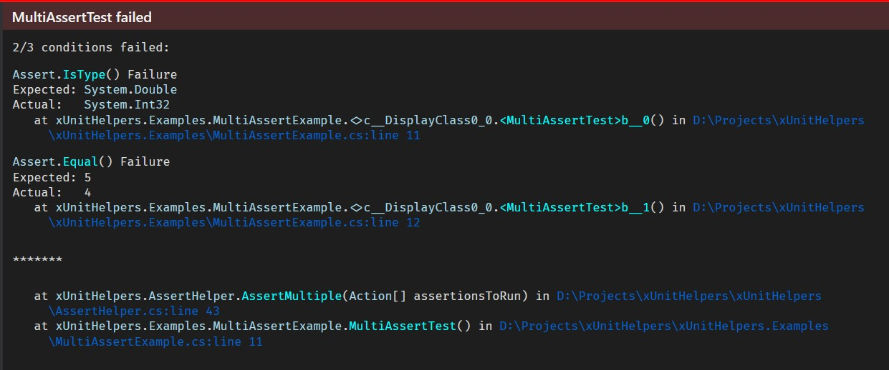

# Usage

## Multiple Asserts

```csharp
[Fact]
public void MultiAssertTest()
{
    var result = 2 + 2;
    AssertHelper.AssertMultiple(() => Assert.IsType<double>(result),
                                () => Assert.Equal(5, result),
                                () => Assert.Equal(4, result));
}
```

### Result


